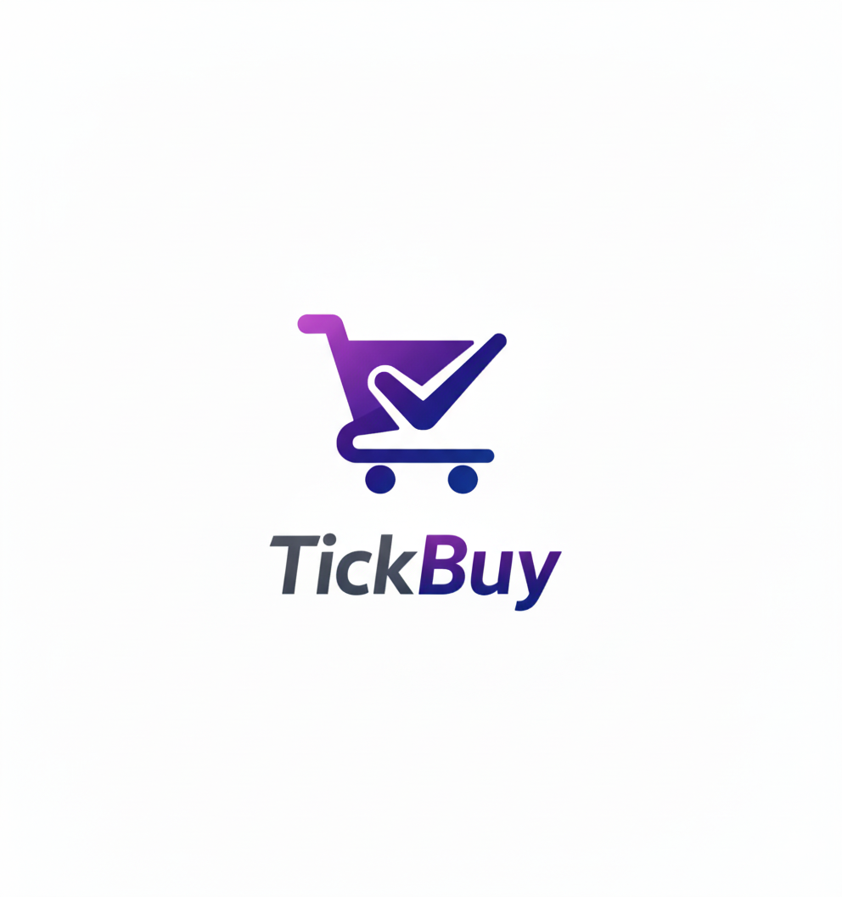
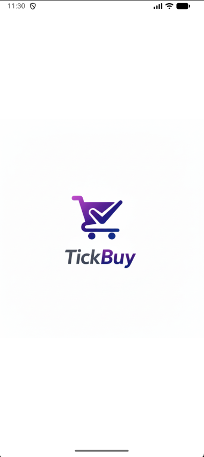
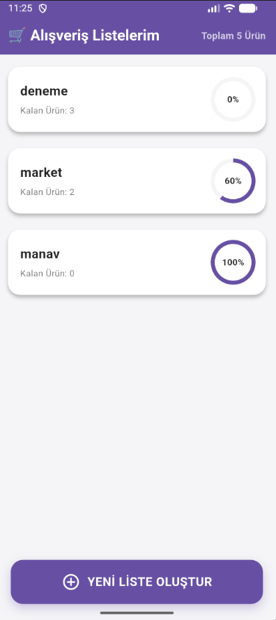
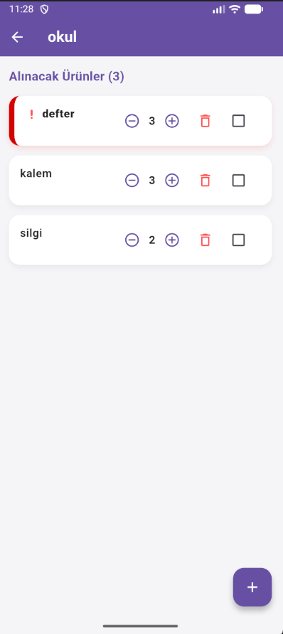
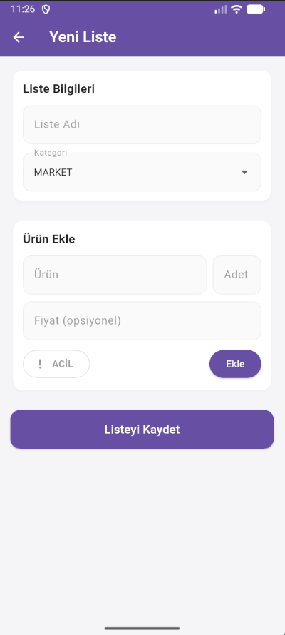

<p align="center">
  
</p>

# 🛒 TickBuy - Alışveriş Listesi
TickBuy, alışveriş süreçlerinizi dijitalleştirerek daha düzenli hale getiren, kullanıcı dostu ve şık tasarımlı bir Flutter uygulamasıdır. Ürünlerinizi kategorize edebilir, aciliyet durumlarını belirleyebilir ve harcamalarınızı kolayca takip edebilirsiniz.

---


## ✨Özellikler
Çoklu Liste Yönetimi: Farklı ihtiyaçlarınız için (Market, Ev, İş vb.) ayrı listeler oluşturun.

İlerleme Takibi: Listenizdeki ürünlerin ne kadarını tamamladığınızı görsel bar üzerinden takip edin.

Acil Durum Etiketi: Unutulmaması gereken kritik ürünleri "Acil" olarak işaretleyin ve kırmızı vurguyla görün.

Kaydırarak Silme (Swipe to Delete): Modern kullanıcı deneyimi için listelerinizi tek bir hareketle silin.

Tahmini Fiyatlandırma: Ürünlere fiyat ekleyerek bütçenizi önceden planlayın.

Yerel Veritabanı: Hive entegrasyonu sayesinde internetiniz olmasa bile verileriniz cihazınızda güvende kalır.

Splash Screen: Uygulama açılışında şık bir logo animasyonu.


---


## 🎨Tasarım
Uygulama, göz yormayan Açık Tema (Light Mode) prensibiyle tasarlanmıştır:

Temiz beyaz arka planlar.

Yumuşak gölgeli modern kart tasarımları.

Modern tipografi ve canlı aksan renkleri.


---

## 🛠️Kullanılan Teknolojiler
Framework: Flutter

State Management: Provider

Database: Hive (Local NoSQL Storage)

Animations: Flutter AnimationController & Transitions


---

 
## 📸 Ekran Görüntüleri

| Splash | Home |
|-------|------|
|  |  |

| Detail | Create |
|-------|--------|
|  |  |


---

## 📦 APK İndirme

Uygulamanın **APK sürümü**, GitHub Releases üzerinden paylaşılmıştır.

👉 [APK’yı İndir (v1.0.0)](https://github.com/sudenrkra/tickBuy_app/releases/tag/v1.0.0)

APK dosyasını Android cihazınıza indirerek uygulamayı doğrudan kurabilirsiniz.  
Kurulum sırasında gerekirse **“Bilinmeyen kaynaklara izin ver”** seçeneğini aktif etmeniz yeterlidir.

---
## 📁 Proje Yapısı
```text
lib/
 ├── models/          #  Veri modelleri (UrunOgesi, AlisverisListesi)
 ├── screens/         #  UI Ekranları (Home, Detail, Create, Splash)
 ├── services/        #  Veri yönetimi ve Provider sınıfları
 └── main.dart        #  Uygulama giriş noktası

