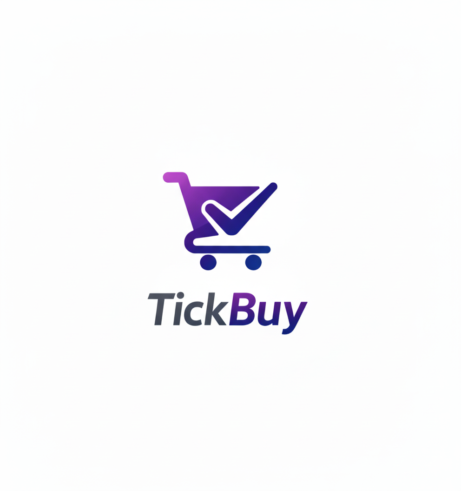
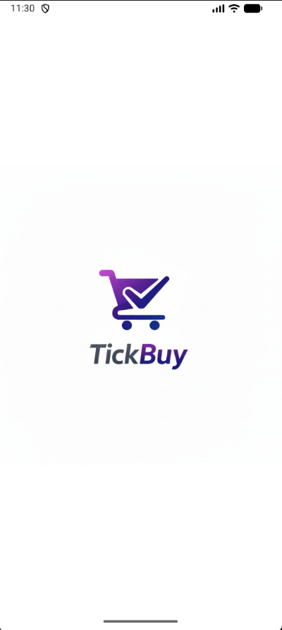
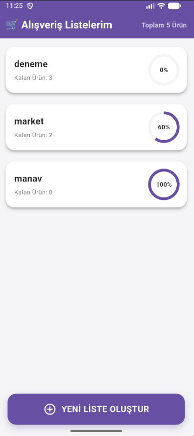
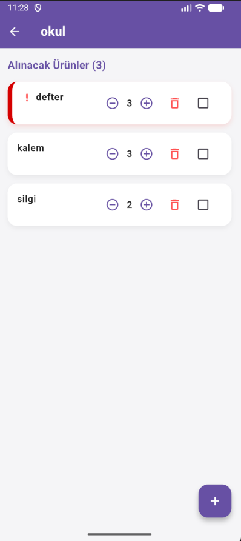
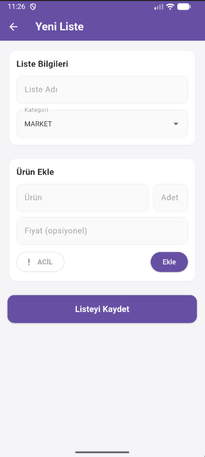

<p align="center">
  
</p>

<h1 align="center">🛒 TickBuy - Alışveriş Listesi</h1>

<p align="center">
  
  
  
</p>

<p align="center">
  TickBuy, alışveriş süreçlerinizi dijitalleştirerek daha düzenli hale getiren, kullanıcı dostu ve şık tasarımlı bir Flutter uygulamasıdır. Ürünlerinizi kategorize edebilir, aciliyet durumlarını belirleyebilir ve harcamalarınızı kolayca takip edebilirsiniz.
</p>

---

### 💻 Tech Stack & İstatistikler
   


---

### ✨ Özellikler
- 📑 **Çoklu Liste Yönetimi:** Farklı ihtiyaçlarınız için (Market, Ev, İş vb.) ayrı listeler oluşturun.
- 📈 **İlerleme Takibi:** Listenizdeki ürünlerin tamamlanma oranını görsel bar üzerinden izleyin.
- 🚨 **Acil Durum Etiketi:** Kritik ürünleri "Acil" olarak işaretleyin ve kırmızı vurguyla görün.
- ↔️ **Kaydırarak Silme:** Modern kullanıcı deneyimi için listeleri tek bir hareketle yönetin.
- 💰 **Tahmini Fiyatlandırma:** Ürünlere fiyat ekleyerek bütçenizi önceden planlayın.
- 🔐 **Yerel Veritabanı:** Hive entegrasyonu ile internetiniz olmasa bile verileriniz cihazınızda güvende.
- 🚀 **Splash Screen:** Uygulama açılışında şık bir logo animasyonu.

---

### 📸 Ekran Görüntüleri

<p align="center">
   
  
  
  
</p>

---

### 🎥 Tanıtım Videosu
Uygulamanın nasıl çalıştığını buradan izleyebilirsiniz:
[](https://youtu.be/083Q9F-g0nE)

---

### 📦 Kurulum & APK
Uygulamanın **APK sürümü**, GitHub Releases üzerinden paylaşılmıştır.

👉 [**APK’yı İndir (v1.0.0)**](https://github.com/sudenrkra/tickBuy_app/releases/tag/v1.0.0)

> **Not:** Kurulum sırasında gerekirse “Bilinmeyen kaynaklara izin ver” seçeneğini aktif etmeniz yeterlidir.

---

### 📁 Proje Yapısı
```text
lib/
 ├── models/          # Veri modelleri (UrunOgesi, AlisverisListesi)
 ├── screens/         # UI Ekranları (Home, Detail, Create, Splash)
 ├── services/        # Veri yönetimi ve Provider sınıfları
 └── main.dart        # Uygulama giriş noktası
